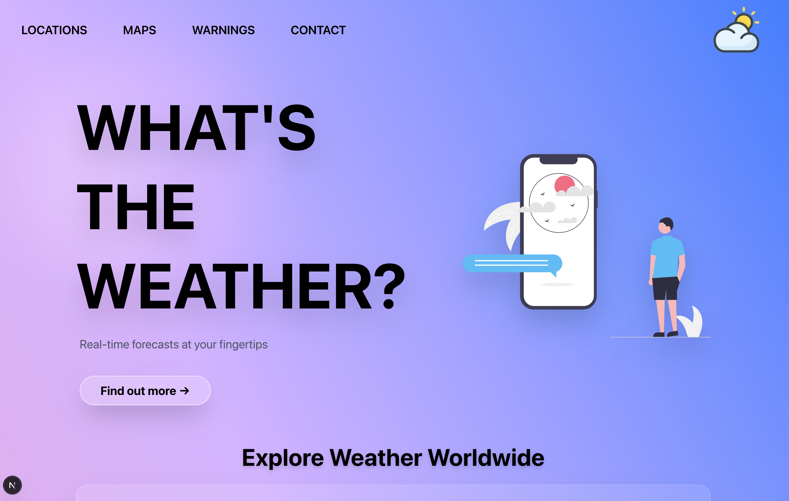
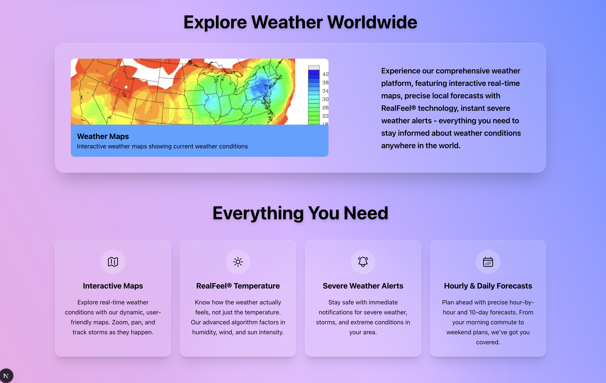
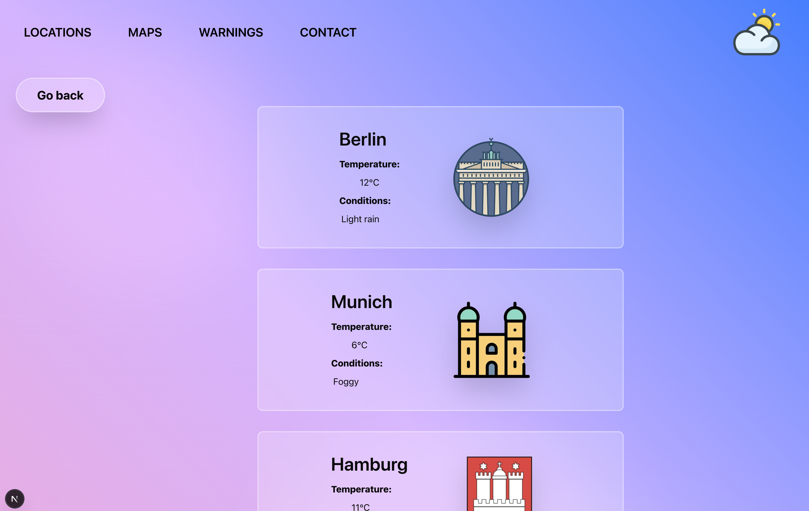
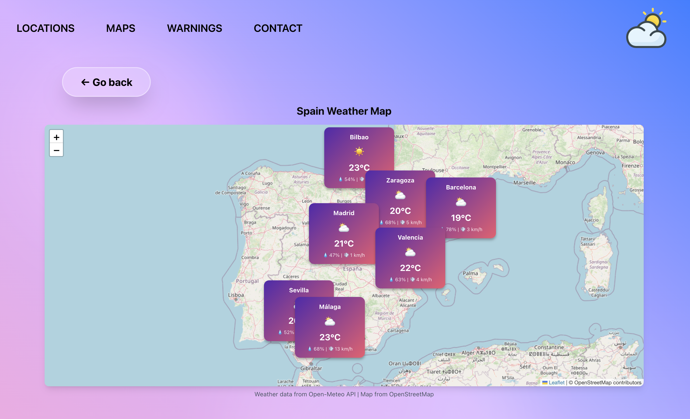

# ☁️ What's the Weather? ☁️

A modern, full-featured weather application built with Next.js 15 that provides real-time weather forecasts and conditions across Spain, Germany, and Tunisia. Features a stunning glassmorphism UI, interactive Leaflet maps with real-time weather markers, auto-rotating carousel, responsive navigation, and integration with multiple weather APIs including AEMET and Open-Meteo.


## 🛠️ Tech Stack

<div align="center">
  <a href="https://nextjs.org/">
    
  </a>
  <a href="https://react.dev/">
    
  </a>
  <a href="https://typescriptlang.org">
    
  </a>
  <a href="https://tailwindcss.com/">
    
  </a>
  <a href="https://nodejs.org/">
    
  </a>
  <a href="https://ui.shadcn.com/">
    
  </a>
  <a href="https://leafletjs.com/">
    
  </a>
  <a href="https://heroicons.com/">
    
  </a>
</div>

## ✨ Features

### Core Weather Features
- **Interactive Weather Maps** - Dynamic Leaflet-based maps with real-time weather markers showing temperature, humidity, and wind speed for major cities
- **Multi-Country Coverage** - Comprehensive weather data for Spain, Germany, and Tunisia
- **Location-Specific Forecasts** - Detailed weather conditions for 9 cities across 3 countries:
  - **Spain**: Valencia, Madrid, Barcelona
  - **Germany**: Munich, Berlin, Hamburg
  - **Tunisia**: Tunis, Sfax, Sousse
- **RealFeel® Technology** - Advanced algorithm that factors in humidity, wind, and sun intensity to show how the weather actually feels
- **Severe Weather Alerts** - Stay safe with immediate notifications for storms and extreme conditions
- **Hourly & Daily Forecasts** - Precise hour-by-hour and extended forecasts

### User Interface
- **Modern Homepage** - Comprehensive landing page with hero section, feature showcase, and call-to-action blocks
- **Auto-Rotating Carousel** - Interactive feature carousel showcasing location forecasts, maps, warnings, and detailed forecasts
- **Responsive Navigation** - Mobile-friendly navbar with hamburger menu for smaller screens
- **Glassmorphism Design** - Modern UI with frosted glass effects, backdrop blur, and smooth animations
- **Newsletter Subscription** - Stay connected with weather updates and exclusive offers
- **Complete Footer** - Reusable footer component with:
  - Social media integration (Facebook, Twitter, LinkedIn, Instagram)
  - Navigation sections (Features, About Us, Service)
  - Copyright information and logo
  - Consistent width constraints across all pages

**Frontend:** Next.js 15, React 19, TypeScript, Tailwind CSS
**UI Components:** shadcn/ui, Heroicons
**Forms:** React Hook Form, Zod (validation), Sonner (toast notifications)
**Maps:** Leaflet (OpenStreetMap integration)
**APIs:** AEMET (Spain), Open-Meteo (Germany & Tunisia)

## ☁️ Views 






## 🚀 Getting Started

### Prerequisites

- Node.js 20+ installed
- npm, yarn, pnpm, or bun package manager
- AEMET API key (for Spanish weather data)
- Access to DWD API (for German weather data - no key required)

### Installation

1. Clone the repository:
```bash
git clone <your-repository-url>
cd whats-the-weather
```

2. Install dependencies:
```bash
npm install
# or
yarn install
# or
pnpm install
# or
bun install
```

3. Create a `.env` file in the root directory and add your AEMET API key:
```bash
AEMET_API_KEY="your-aemet-api-key-here"
```

4. Run the development server:
```bash
npm run dev
# or
yarn dev
# or
pnpm dev
# or
bun dev
```

5. Open [http://localhost:3000](http://localhost:3000) in your browser to see the application.

## 📁 Project Structure

```
whats-the-weather/
├── app/
│   ├── api/
│   │   ├── aemet/          # AEMET API route handler (Spain)
│   │   ├── germany/        # Germany weather API route handler
│   │   └── open-meteo/     # Open-Meteo API route handler (Tunisia)
│   ├── locations/
│   │   ├── page.tsx        # Locations overview page
│   │   ├── spain/          # Spain weather page (Valencia, Madrid, Barcelona)
│   │   ├── germany/        # Germany weather page (Munich, Berlin, Hamburg)
│   │   └── tunis/          # Tunisia weather page (Tunis, Sfax, Sousse)
│   ├── maps/
│   │   ├── page.tsx        # Maps overview page
│   │   ├── spain/          # Interactive Spain weather map
│   │   └── germany/        # Interactive Germany weather map
│   ├── warnings/           # Weather warnings/alerts page
│   ├── contact/            # Contact page
│   ├── globals.css         # Global styles with animations
│   ├── layout.tsx          # Root layout with navbar, footer, and flex layout
│   └── page.tsx            # Homepage with hero, carousel, and newsletter
├── components/
│   ├── ui/                 # shadcn/ui components (button, card, form, input, label)
│   ├── navbar.tsx          # Responsive navigation with mobile menu
│   ├── footer.tsx          # Reusable footer with navigation and social links
│   ├── carousel.tsx        # Auto-rotating weather feature carousel
│   └── background.tsx      # Animated background component
├── lib/
│   └── utils.ts            # Utility functions (cn helper)
├── public/
│   ├── features/           # Carousel feature images
│   ├── locations/          # City-specific images and icons
│   ├── logo.png            # Application logo
│   └── Hero.svg            # Hero section illustration
└── .env                    # Environment variables
```

## 🔑 Environment Variables

Create a `.env` file in the root directory with the following variables:

```bash
# AEMET API (Spanish Meteorological Agency)
AEMET_API_KEY=your_api_key_here
```

### Getting an AEMET API Key

1. Visit [AEMET OpenData](https://opendata.aemet.es/)
2. Register for a free account
3. Generate your API key
4. Add it to your `.env` file

## 📜 Available Scripts

- `npm run dev` - Start development server with Turbopack
- `npm run build` - Build for production with Turbopack
- `npm start` - Start production server
- `npm run lint` - Run ESLint

## 🧪 Testing

Tests use [Vitest](https://vitest.dev/) + [React Testing Library](https://testing-library.com/docs/react-testing-library/intro/) with a `jsdom` environment (`vitest.config.js`, `vitest.setup.ts`). Run them with:

```bash
npx vitest run
```

or `npx vitest run <path>` to run a single file.

### Pages (`tests/app/`)

- **`page.test.tsx`** (homepage) — hero heading, "Find out more" link to `/maps`, hero image alt text, feature cards, free trial button, and the newsletter subscribe form.
- **`layout.test.tsx`** — root layout renders the nav link to `/locations` and the footer's copyright line; mocks `next/font/google` since font loaders don't work under `jsdom`.
- **`policy/page.test.tsx`** / **`terms/page.test.tsx`** — heading plus every numbered section title renders; terms page also checks the contact `mailto:` link.
- **`locations/page.test.tsx`** / **`maps/page.test.tsx`** — overview pages: heading plus the country links point at the right routes (`/locations/spain`, `/maps/germany`, etc).

### Locations subpages (`tests/app/locations/{germany,spain,tunis}/page.test.tsx`)

Each of these pages fetches live weather data per city in a `useEffect` and navigates back via `useRouter`, so each test file follows the same four-case shape:

1. **Loading state** — `fetch` is mocked to return a promise that never resolves, so the component stays in its initial loading render; asserts the "Loading Weather..." text.
2. **Success** — `fetch` is mocked with `mockImplementation`, branching on the request URL to return a different fake response per city; asserts each city's temperature and condition render (using `findBy*` queries, since the data only appears after the mocked promises resolve and React re-renders).
3. **Partial failure** — one city's branch returns `ok: false` (simulating a failed request), which exercises the component's real error-handling path; asserts that city shows `"N/A"` / `"Data unavailable"` while the other two cities still render their real data.
4. **Navigation** — mocks a successful load for all cities, waits for the "Go back" button to appear (it's only rendered once loading finishes), clicks it, and asserts `router.push` was called with `/locations`.

### Components (`tests/components/`)

- **`navbar.test.tsx`** — desktop nav links, mobile menu links hidden until the toggle button is clicked, and that clicking again un-mounts them.
- **`footer.test.tsx`** — section headings, navigation links, legal page links, copyright text, and the footer logo.
- **`carousel.test.tsx`** — all slide images render, only one slide is active at a time, and slides auto-advance (and wrap back to the first) using `vi.useFakeTimers()` to fast-forward the rotation interval instead of waiting in real time.

### UI primitives (`tests/components/ui/`)

- **`button.test.tsx`** — renders with the right classes per variant, disabled state, and fires `onClick`.
- **`input.test.tsx`** — renders with a placeholder and updates its value as the user types.
- **`label.test.tsx`** — renders and is correctly associated with its field via `htmlFor`.
- **`card.test.tsx`** — a full card composed from its parts (`CardHeader`, `CardTitle`, `CardDescription`, `CardContent`, `CardFooter`) renders all its content.
- **`form.test.tsx`** — a React Hook Form + Zod-validated form built from `Form`/`FormField`/`FormItem`: renders label and input, shows a validation error on empty submit, and calls `onSubmit` with the typed values on a valid submit.

## 🌍 API Integration

The application integrates with three different weather data providers to ensure comprehensive coverage:

### AEMET API (Spain)

The AEMET API (Agencia Estatal de Meteorología) provides official weather data for Spanish locations:

- **Cities**: Valencia, Madrid, Barcelona
- **Data Points**: Temperature, humidity, pressure, wind speed, precipitation, sunshine duration
- **Conditions**: Dynamic weather conditions based on multiple factors (rain, sunshine, humidity)
- **Authentication**: Requires API key (free tier available)
- **Route**: `/api/aemet`

### Open-Meteo API (Germany & Tunisia)

Open-Meteo provides free, open-source weather data with no authentication required:

**Germany Coverage:**
- **Cities**: Munich, Berlin, Hamburg
- **Data Points**: Temperature, humidity, weather code, wind speed, precipitation
- **Map Integration**: Real-time weather markers with Leaflet
- **Route**: `/api/germany`

**Tunisia Coverage:**
- **Cities**: Tunis, Sfax, Sousse
- **Data Points**: Temperature, precipitation, weather conditions
- **Route**: `/api/open-meteo`

**Features:**
- No API key required
- High-quality open data
- Real-time updates
- Multiple European and African regions

## 🗺️ Application Pages

### Homepage (`/`)
- Hero section with animated illustration
- Call-to-action button to explore maps
- Auto-rotating feature carousel
- Four feature cards highlighting key capabilities
- Free trial promotional block
- Newsletter subscription form
- Comprehensive footer with navigation and social links

### Locations (`/locations`)
- Overview page for all available locations
- Country-specific weather pages:
  - `/locations/spain` - Valencia, Madrid, Barcelona with AEMET data
  - `/locations/germany` - Munich, Berlin, Hamburg with Open-Meteo data
  - `/locations/tunis` - Tunis, Sfax, Sousse with Open-Meteo data
- Real-time temperature and weather conditions
- City-specific images and icons
- Loading states with spinner animations

### Maps (`/maps`)
- Overview page for available weather maps
- Interactive Leaflet maps:
  - `/maps/spain` - Spain weather map with 7 major cities
  - `/maps/germany` - Germany weather map with real-time markers
- Dynamic weather markers showing:
  - Temperature
  - Humidity percentage
  - Wind speed
  - Weather emoji icons
- Popup details on marker click
- OpenStreetMap tile layer

### Other Pages
- `/warnings` - Weather warnings and alerts (placeholder)
- `/contact` - Full-featured contact page with form validation:
  - React Hook Form integration with Zod schema validation
  - Fields: First Name, Last Name, Email, Subject, Message
  - Toast notifications on form submission
  - Contact details display (phone, email, address)
  - Responsive layout with side-by-side desktop view

## 🎨 Design Features

- **Glassmorphism Effects** - Frosted glass design with backdrop blur on cards and navigation
- **Smooth Animations** - CSS animations including floating hero elements and carousel transitions
- **Responsive Layout** - Mobile-first design with hamburger menu for small screens
- **Modern Color Scheme** - Gradient backgrounds with white overlay elements
- **Interactive Components** - Hover effects, scale transitions, and smooth state changes
- **Auto-Rotating Carousel** - 3-second interval feature showcase with smooth transitions
- **Dynamic Weather Icons** - Emoji-based weather indicators on interactive maps
- **Loading States** - Spinner animations for asynchronous data fetching
- **Social Media Integration** - Footer with animated social icons (Facebook, Twitter, LinkedIn, Instagram)

## 📝 Learn More

- [Next.js Documentation](https://nextjs.org/docs) - Learn about Next.js features and API
- [React Documentation](https://react.dev) - Learn React
- [Tailwind CSS Documentation](https://tailwindcss.com/docs) - Learn Tailwind CSS
- [shadcn/ui Documentation](https://ui.shadcn.com) - Learn about the UI components
- [Leaflet Documentation](https://leafletjs.com/reference.html) - Interactive map library
- [AEMET OpenData](https://opendata.aemet.es/) - Spanish weather data API
- [Open-Meteo API](https://open-meteo.com/) - Free weather API documentation

## 🤝 Contributing

Contributions are welcome! Feel free to open issues or submit pull requests.

## 📄 License

This project is private and not licensed for public use.
